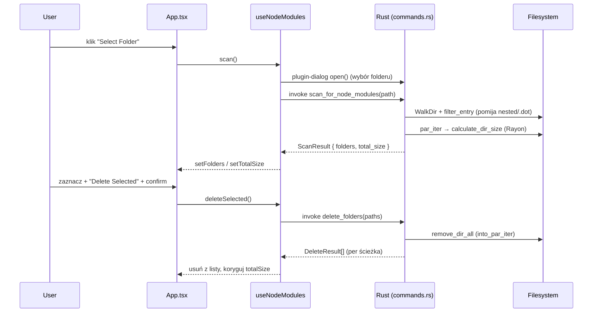

# Architecture — model myślowy

> Apka Tauri = jeden proces Rust (backend, dostęp do systemu) + jeden webview
> (React, UI). Jedyny kanał komunikacji to **`invoke`** (front → Rust) zwracający
> JSON serializowany przez serde. Cała wrażliwa robota (FS) jest po stronie Rust.

## Inwarianty systemu

1. **Front NIGDY nie dotyka systemu plików bezpośrednio** — każdy skan/usuwanie/
   rozmiar idzie przez komendę Tauri (`invoke`). Plugin-dialog to jedyny wyjątek
   (wybór folderu), też przez most.
2. **Kontrakt typów jest jednym, ręcznie synchronizowanym źródłem prawdy w DWÓCH
   plikach** — structy Rust (commands.rs:8-34) i `types.ts:1-23` MUSZĄ się zgadzać
   co do nazw pól (snake_case). Brak codegenu. To najwrażliwszy punkt utrzymania.
3. **Stan żyje w jednym hooku** — `useNodeModules` (patrz [[module-frontend-hooks]]);
   komponenty są bezstanowe.
4. **Operacje są równoległe i odporne na częściowe błędy** — skan i usuwanie
   używają Rayon; usuwanie zbiera wynik per-ścieżka (`DeleteResult`), nie przerywa
   na pierwszym błędzie.

## Przepływ żądania (skan + usuwanie)

## Tabele diagnostyczne

**Komenda "not found" w runtime mimo że kod jest:**
1. Czy dodana do `generate_handler!`? (main.rs:13-17)
2. Czy zaimportowana w `use commands::{...}`? (main.rs:6)
3. Czy nazwa w `invoke('...')` zgadza się 1:1 z nazwą funkcji?

**Dane przychodzą z backendu, ale UI pokazuje `undefined`:**
1. snake_case mismatch pola Rust ↔ `types.ts`? (najczęstsza przyczyna)
2. Czy `invoke<T>` ma poprawny typ generyczny T?
3. Sprawdź surowy JSON w DevTools Network/console.

**Operacja FS pada / "Check permissions":**
1. Uprawnienie w `capabilities/default.json`? (np. `fs:allow-remove`)
2. Realny `io::Error` w `DeleteResult.error` (nie w generycznym banerze).
3. Na macOS — czy folder nie jest chroniony przez SIP/TCC?

## Related
[[moc-codebase]] · [[module-backend]] · [[known-issues]] · [[adr-001-tauri-over-electron]]
