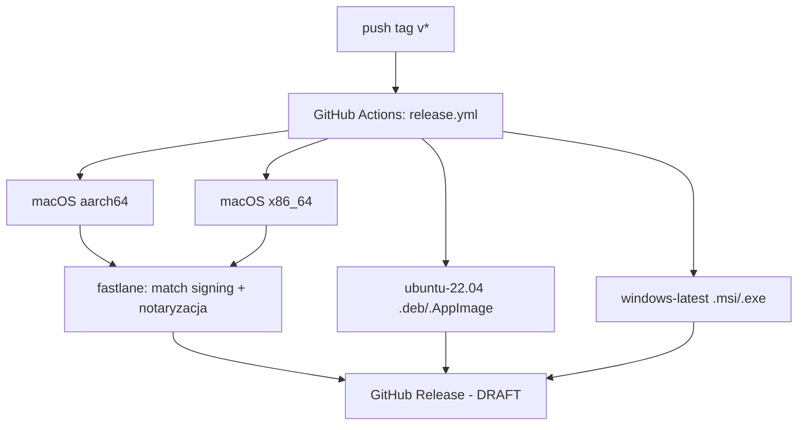

# Playbook: release — wydanie wersji i podpisywanie

> Kanoniczna definicja procesu: `.github/workflows/release.yml`. Release jest
> triggerowany pushem taga `v*`. Ten playbook to nawigacja + pułapki.

## Topologia buildu (Mermaid)

## Steps

| # | Step | Gdzie żyje prawda |
|---|---|---|
| 1 | Podbij wersję w `package.json`, `tauri.conf.json`, `Cargo.toml` (3 miejsca!) | te 3 pliki |
| 2 | Commit, `git tag vX.Y.Z`, `git push --tags` | — |
| 3 | CI buduje 4 targety + tworzy **draft** release | `release.yml` |
| 4 | macOS: fastlane synchronizuje certy (match) i podpisuje/notaryzuje | `fastlane/`, `release.yml` (kroki macOS) |
| 5 | Ręcznie opublikuj draft release na GitHubie | — |

## Co się NAPRAWDĘ zapomina (specyficzne dla projektu)

1. **Wersja żyje w 3 miejscach** — `package.json:4`, `tauri.conf.json` (version),
   `src-tauri/Cargo.toml` (version). Rozjazd = niespójne metadane bundla. Zsynchronizuj
   wszystkie trzy.
2. **Release jest DRAFTEM** (`releaseDraft: true` w release.yml) — nie publikuje
   się sam, trzeba ręcznie kliknąć Publish.
3. **Sprzeczność dokumentacji**: README mówi "app is not code-signed", ale CI
   robi fastlane match + notaryzację na macOS, a `tauri.conf.json` ma
   `signingIdentity: "-"` (ad-hoc). Realny stan podpisu zależy od sekretów CI.
   Patrz [[adr-004-macos-signing-strategy]].
4. **Filtr `paths:` na evencie tagów** (release.yml) — push taga bez zmian w
   `src/**`/`src-tauri/**`/manifestach może NIE odpalić joba (hipoteza —
   zachowanie path-filtra na tag pushach bywa zawodne; użyj `workflow_dispatch`
   jeśli job nie wystartuje).
5. **macOS wymaga sekretów** (`APPLE_ID`, `MATCH_PASSWORD`, `APPLE_TEAM_ID`, ...) —
   bez nich kroki signing/notaryzacji padną. Lista w `release.yml`.

## Related
[[module-ci-release]] · [[module-tauri-config]] · [[adr-004-macos-signing-strategy]]
